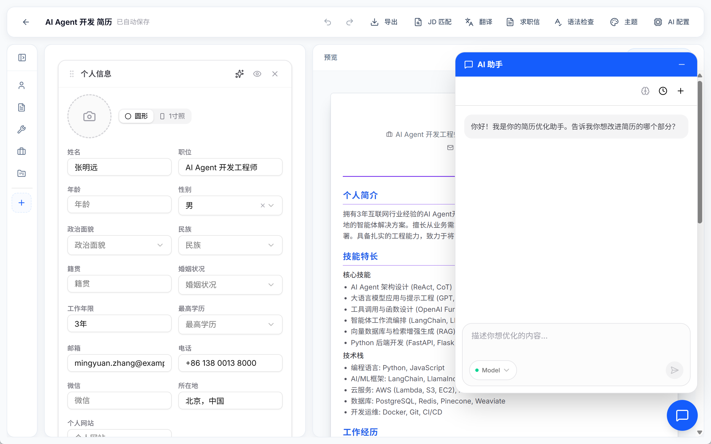
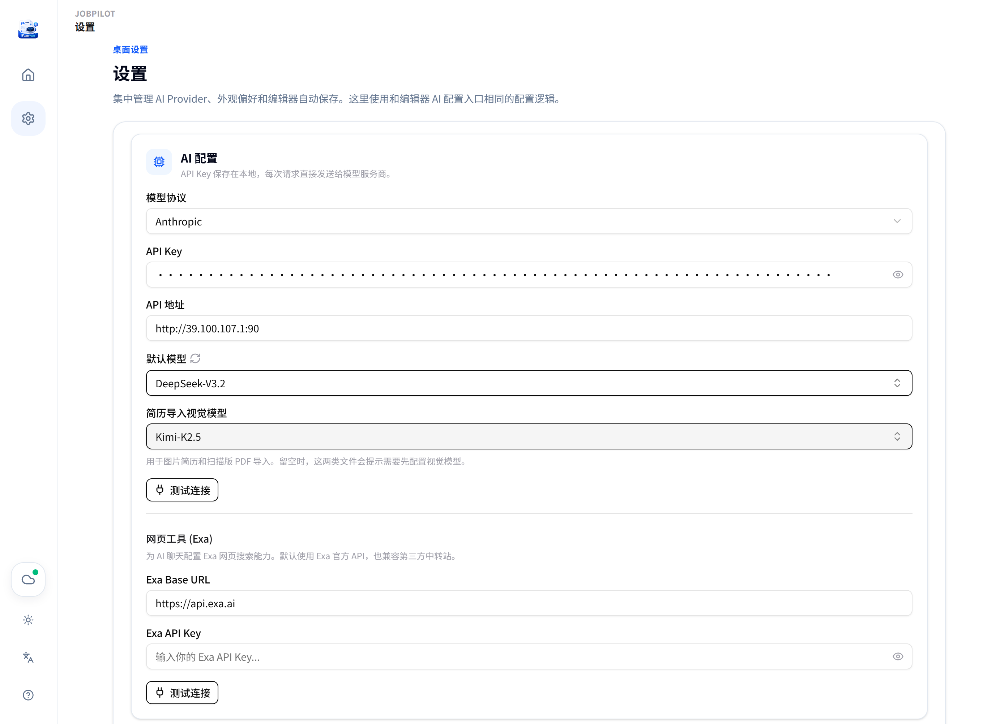
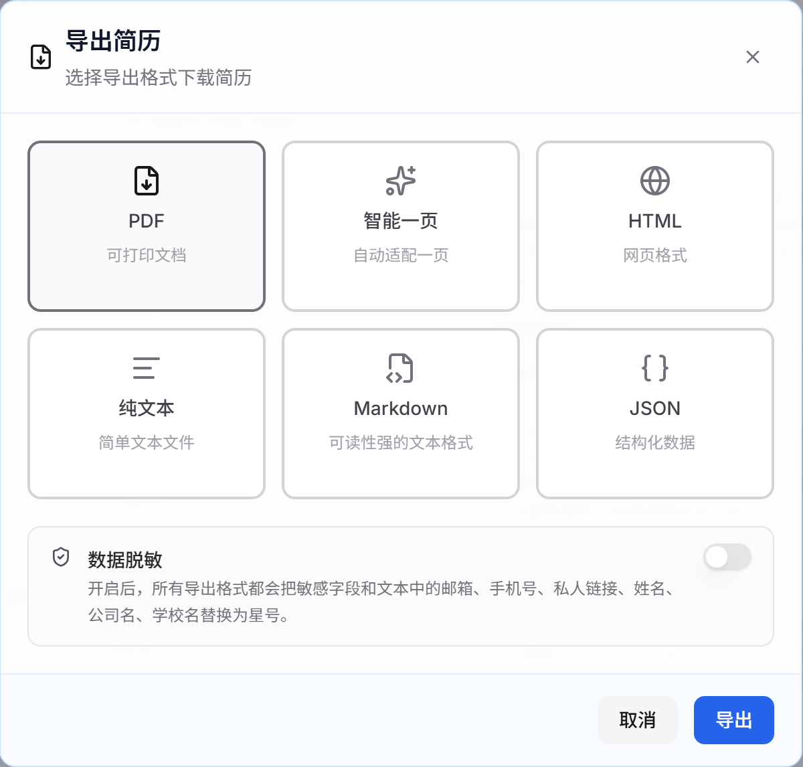
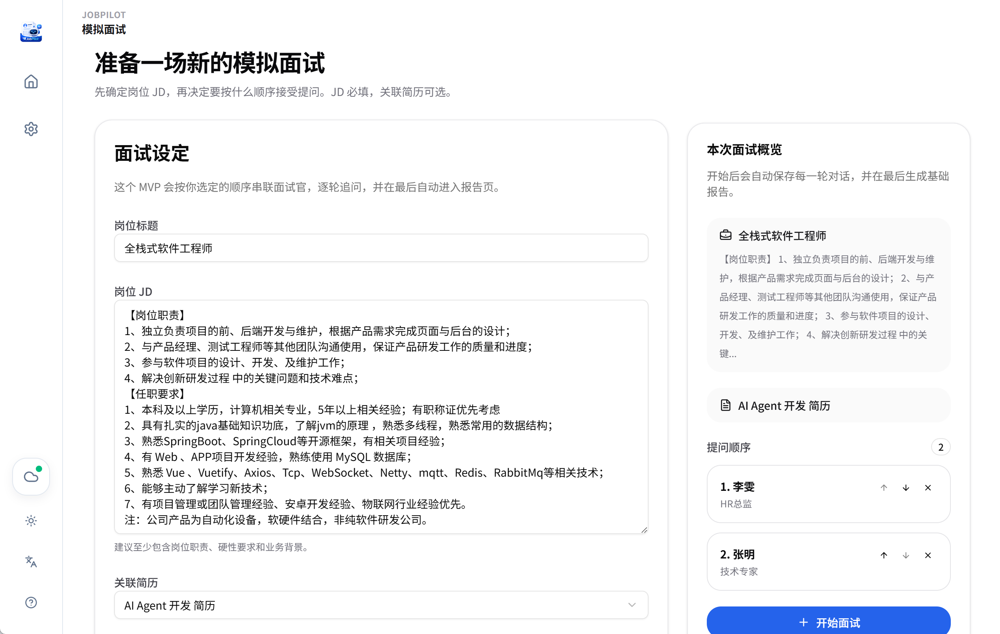

<div align="center">
  

  **Local-First AI Resume Workbench**

  [](LICENSE)
  [](https://tauri.app/)
  [](https://react.dev/)
  [](https://www.typescriptlang.org/)
  [](./desktop)
  [](https://linux.do/)

  [中文文档](./README_CN.md) | English

</div>


---

JobPilot is a **local-first AI-powered desktop application** for job seekers, helping you create, optimize resumes, simulate interviews, and review performance. From resume writing to interview preparation, JobPilot covers the entire job hunting workflow. Simply download and start using—no server setup required.

## ✨ Key Features

<details>
<summary><b>Core Features (from JadeAI)</b></summary>

- **Drag-and-Drop Resume Editor** — Inline editing, auto-save, module reordering
- **50+ Resume Templates** — Classic, modern, minimal, ATS-friendly styles with theme customization
- **AI Assistant** — Resume generation, content optimization, JD matching analysis, cover letter writing, translation & polishing
- **Resume Parsing** — Extract resume content from PDF and images
- **Multi-Format Export** — PDF, PNG, Word, and more
- **Resume Sharing** — Generate shareable links for easy distribution
- **LinkedIn Headshot** — AI-generated professional portrait photos
- **Bilingual Support** — Full internationalization (English/Chinese)
- **Local-First** — Data stored locally, privacy guaranteed

</details>

<details open>
<summary><b>JobPilot Exclusive Features</b></summary>

- **Tauri Desktop App** — Built with Tauri 2 for a native, lightweight, and fast experience. Supports Mac (Apple Silicon)
- **Multi-Format Import** — Import from JSON, Markdown, PDF, and images (PNG/JPG/WebP) with AI-powered smart parsing
- **Enhanced PDF Import** — Supports both regular PDFs and scanned documents using multimodal AI models
- **Markdown Editor** — New editor component with toolbar shortcuts (bold, italic, code, lists, links)
- **Textarea List Component** — Multi-line text input for editing long-form content like experience descriptions
- **In-App Updates** — Automatic update detection and installation
- **Model List Refresh** — Manually refresh available AI models for quick selection
- **Layout Optimization** — Continuous improvements to styling
- **More Templates** — Regularly updated template library
- **WebDAV Cloud Sync** — Encrypted backup to 123Cloud, Nutstore, Nextcloud, and other WebDAV servers with one-click restore

</details>

## 📋 Changelog

See [CHANGELOG.md](./CHANGELOG.md) for detailed version history.

## 🗺️ Roadmap

Planned features for upcoming releases:

- **LinkedIn Headshot** — AI-generated professional portrait photos
- **Resume Version Management** — Compare and restore historical resume versions

> 💡 **Contributions Welcome!** If you have feature suggestions or find bugs, please open an issue on [GitHub Issues](https://github.com/jlifeng/JobPilot/issues) or submit a Pull Request directly.

## 📸 Screenshots

### Workspace & Template Library

| Workspace | Template Library |
|:---------:|:----------------:|
|  |  |

### Resume Editor & AI Assistant

| Edit Resume | AI Assistant |
|:-----------:|:------------:|
|  |  |

### AI Configuration & Import

| AI Config | Parse Markdown | Parse PDF |
|:---------:|:--------------:|:---------:|
|  |  |  |

### Export & Interview

| Multi-Format Export | Mock Interview | Interview Report |
|:-------------------:|:--------------:|:----------------:|
|  |  |  |

## 📥 Installation

1. Go to [GitHub Releases](https://github.com/jlifeng/JobPilot/releases) to download the latest version
2. Download the Windows installer (`.exe` or `.msi`)
3. Double-click to install and launch the app

> Currently supports Windows. macOS version is planned.

## 🔧 Build from Source

### Prerequisites

- Node.js 20+
- pnpm 9+
- Rust stable (required for desktop app build)
- Tauri 2 Windows toolchain

### Install Dependencies

```bash
git clone https://github.com/jlifeng/JobPilot.git
cd JobPilot
pnpm install
```

### Development Mode

```bash
# Start Tauri desktop app in development mode
pnpm run dev:tauri

# Start web version in development mode
pnpm run dev:web
```

### Build for Production

```bash
# Build Tauri desktop application
pnpm run build:tauri
```

## 🛠️ Tech Stack

| Category | Technology |
|----------|------------|
| Framework | Next.js 16, React 19 |
| Desktop App | Tauri 2 |
| Language | TypeScript 5 |
| Styling | Tailwind CSS 4 |
| UI Components | shadcn/ui |
| State Management | Zustand |
| AI SDK | Vercel AI SDK |

## 📄 License

This project is open-sourced under the [Apache License Version 2.0](LICENSE).

## 🙏 Acknowledgments

This project is built upon the following open-source projects:
- [JadeAI](https://github.com/LingyiChen-AI/JadeAI) — Thanks to the original author for the open-source contribution
- [RoleRover](https://github.com/lingshichat/RoleRover) — Thanks to the original author for continuous maintenance

---
